# TP-LINK Kasa Smart Wi-Fi Plug Mini HS103 5.8

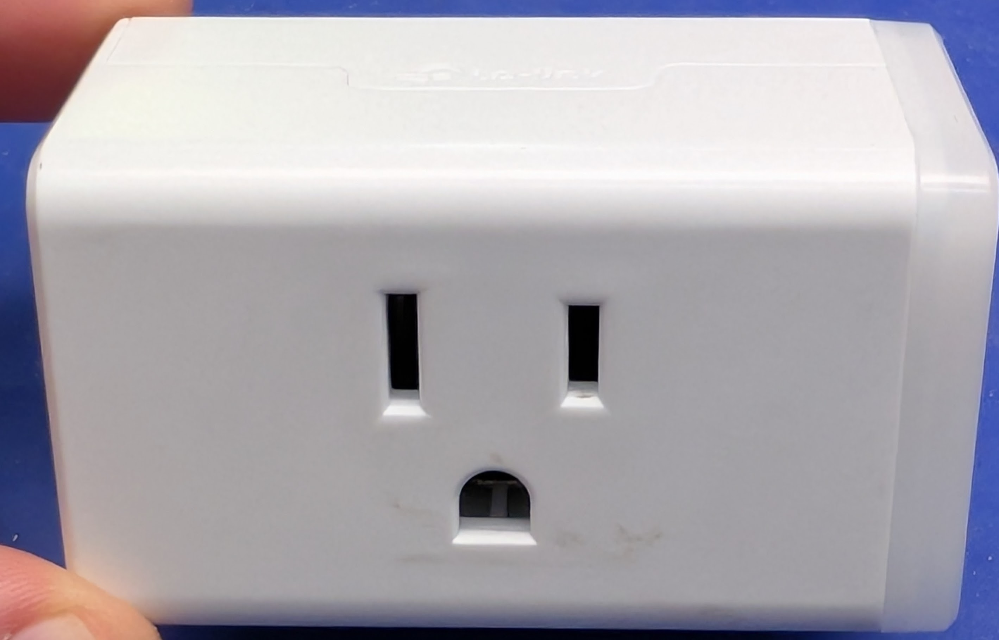

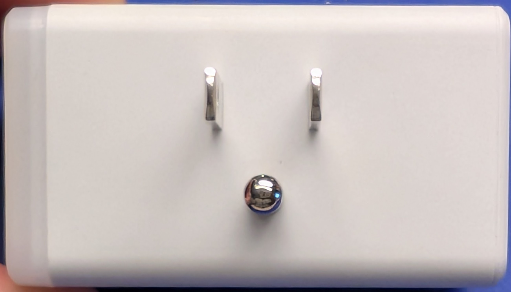

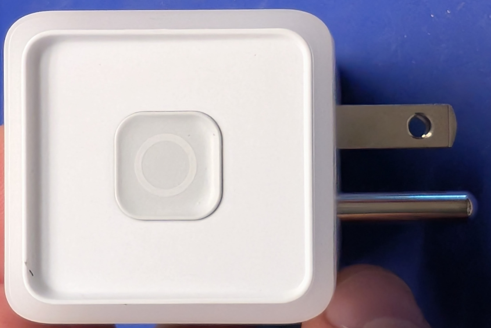

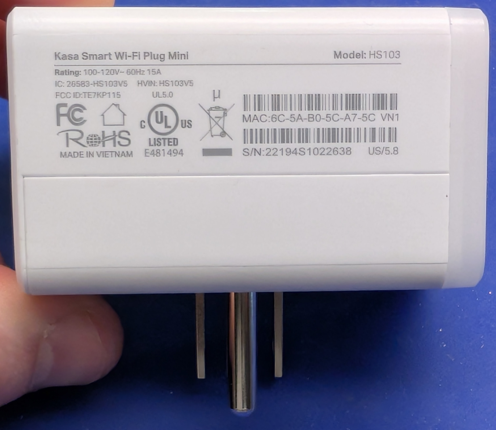

* [Manufacturer ref]()

I've long wanted to take one of these apart,
but haven't had the conviction to destroy one that I have in use.
I found one at Goodwill, and I'm very excited to get into it.

## Checklist

- [ ] Reference materials
    - [ ] Manufacturer docs
    - [ ] Firmware updates
    - [ ] Third-party references
- [x] Factory reset
- [x] External documentation
- [x] Internal documentation
- [ ] Dumped ROM

## Critical Info

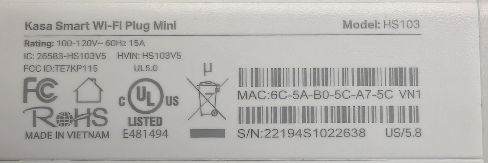

External label:

```text
```

## Reference material:

* [Firmware update]()

## Power Board

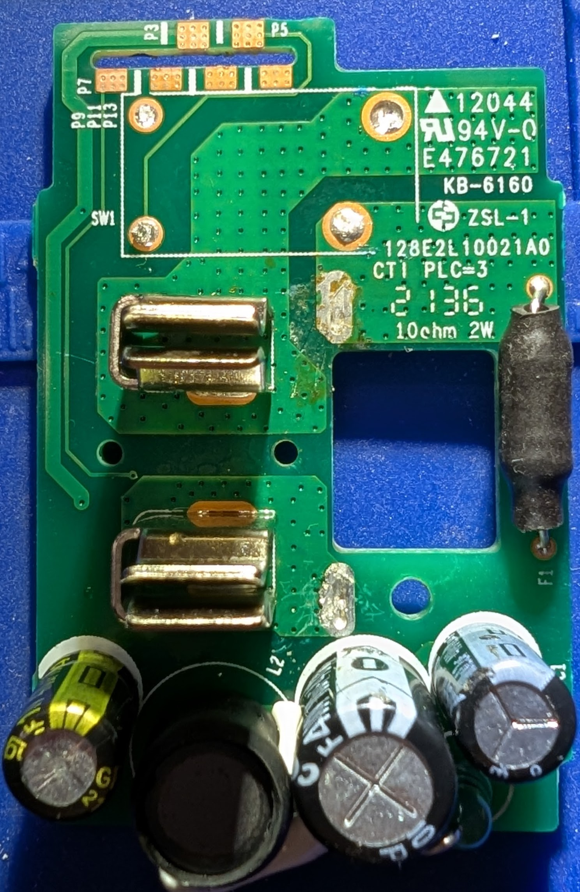

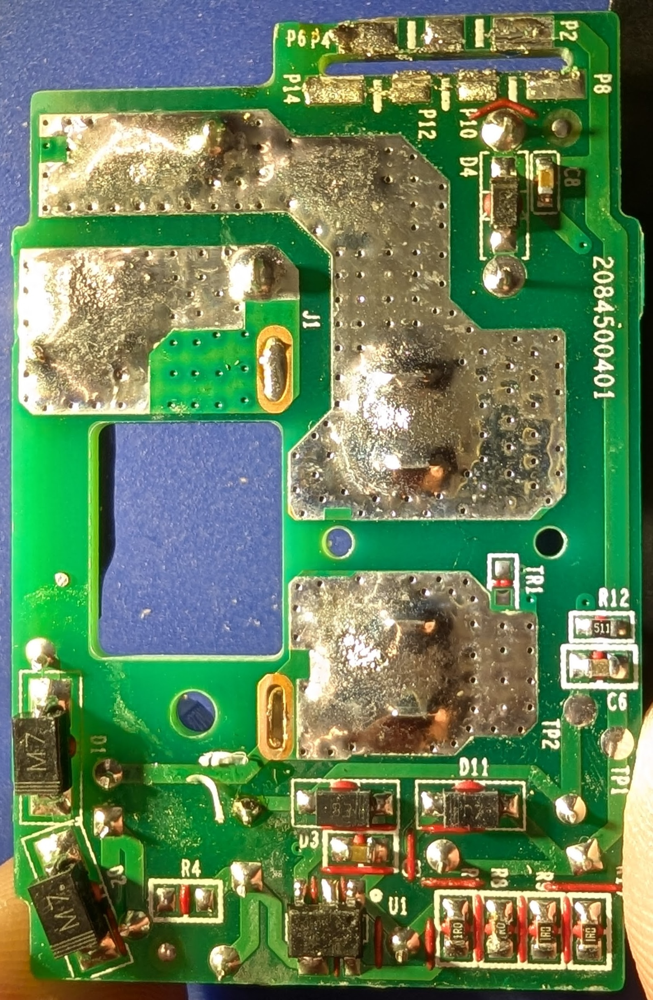

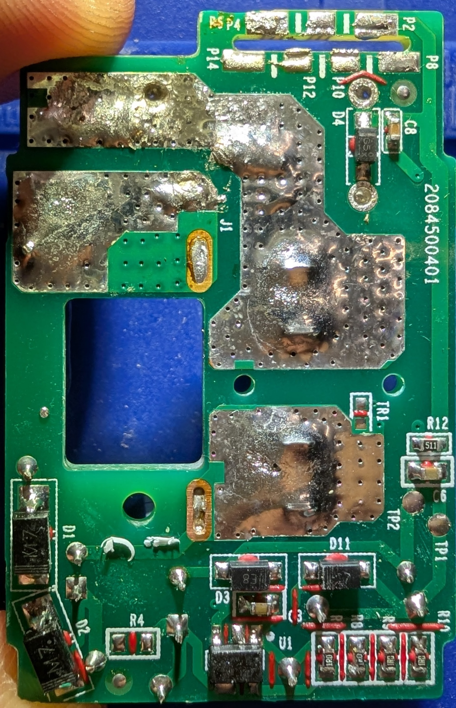

Markings:

```text
12044
```

### Inter-board socket

It's a slot with copper pads for solder.

| Label | Side     | Signal |
|-------|----------|--------|
| P2    | bottom   |        |
| P3    | top      |        |
| P4    | bottom   |        |
| P5    | top      |        |
| P6    | bottom   |        |
| P7    | top      |        |
| P8    | bottom   |        |
| P9    | top      |        |
| P10   | bottom   |        |
| P11   | top      |        |
| P12   | bottom   |        |
| P13   | top      |        |
| P14   | bottom   |        |

## WiFi Module

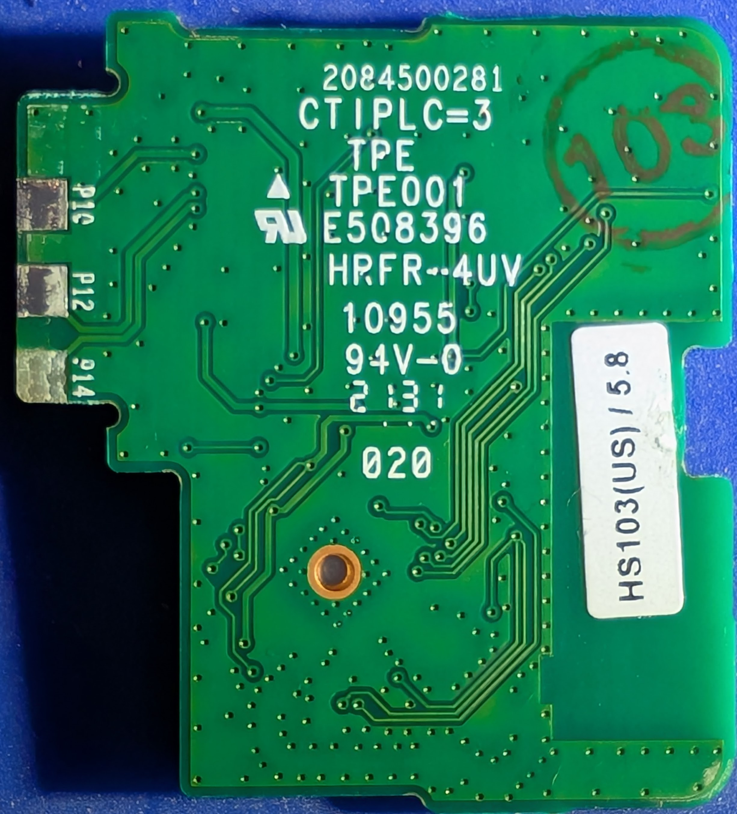

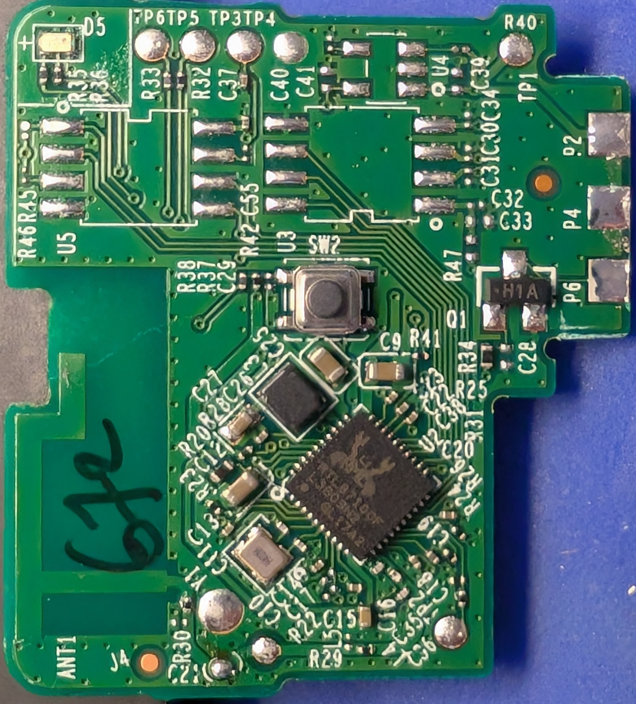

Markings:

```text

```

### Inter-board Gold Finger

| Label | Side   | Signal |
|-------|--------|--------|
| P2    | top    |        |
| P4    | top    |        |
| P6    | top    |        |
| P10   | bottom |        |
| P12   | bottom |        |
| P14   | bottom |        |

### Q1 Generic MMBT3904 NPN BJT

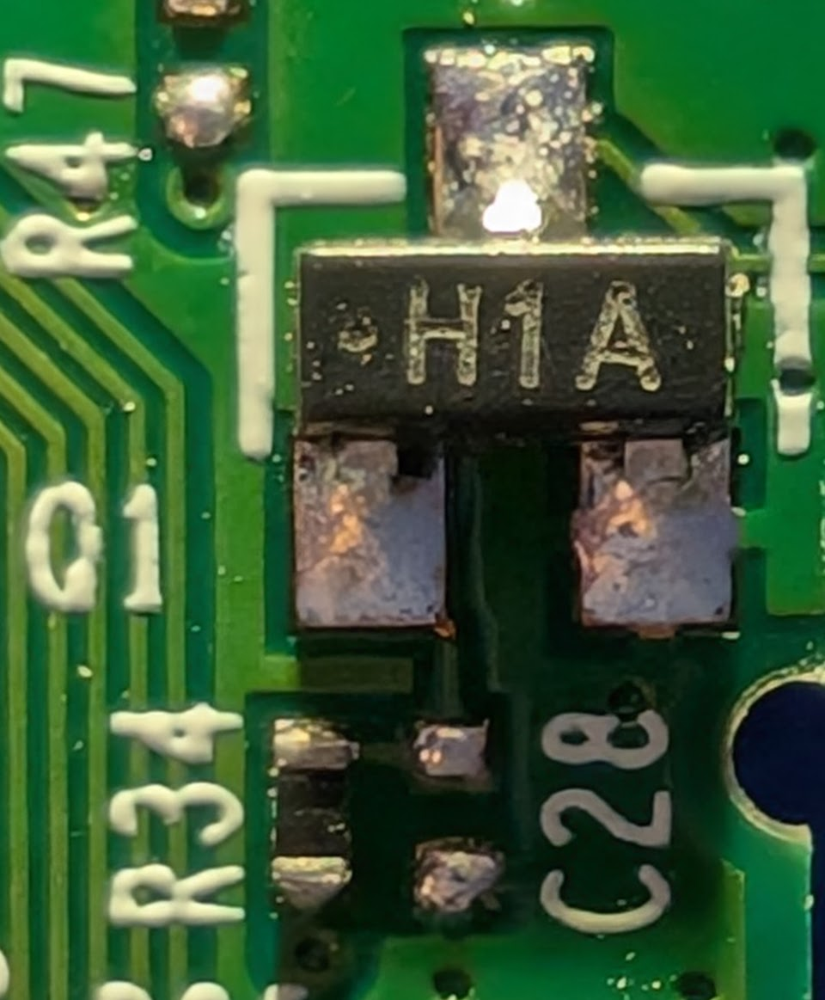

* [Datasheet](https://assets.nexperia.com/documents/data-sheet/PMBT3904.pdf)
* [Manufacturer page]()
* Package: SOT-23-3
* Markings:

```text
H1A
```

### U2 Realtek RTL8710CF 802.11b/g/n ARM Cortex-M4 SoC

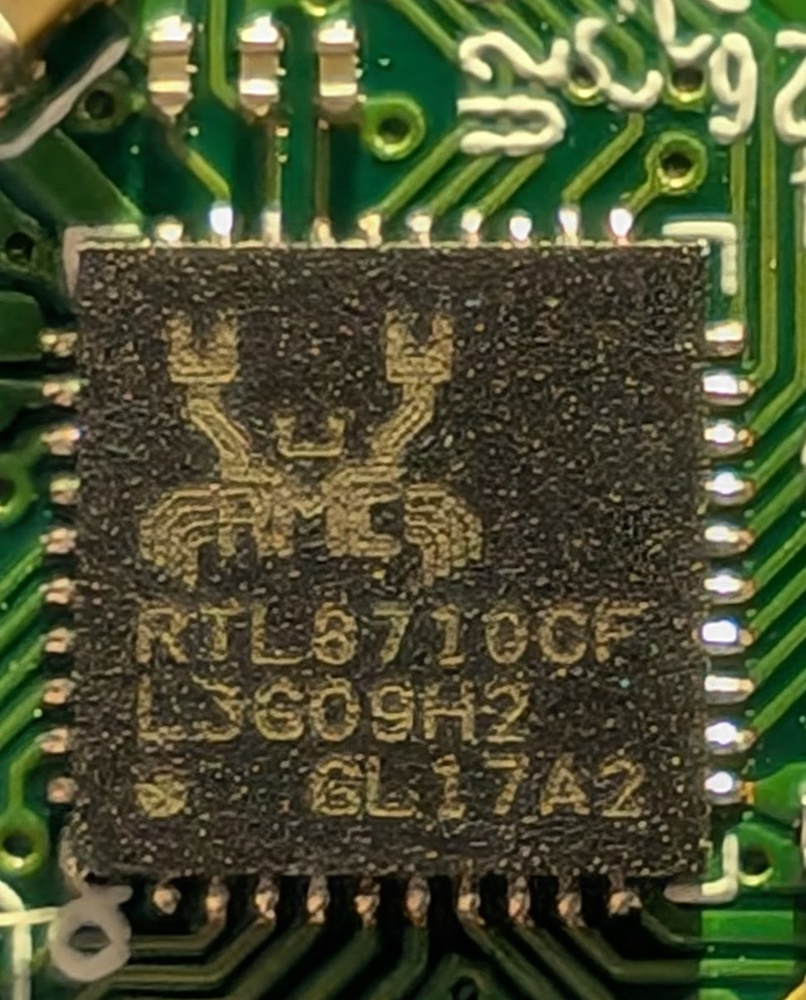

* [Datasheet](https://www.amebaiot.com/en/)
* [Manufacturer page](https://www.amebaiot.com/en/)
* Package: QFN-40
* Markings:

```text
RTL8710CF
```

## Firmware

## Conclusion: ?
